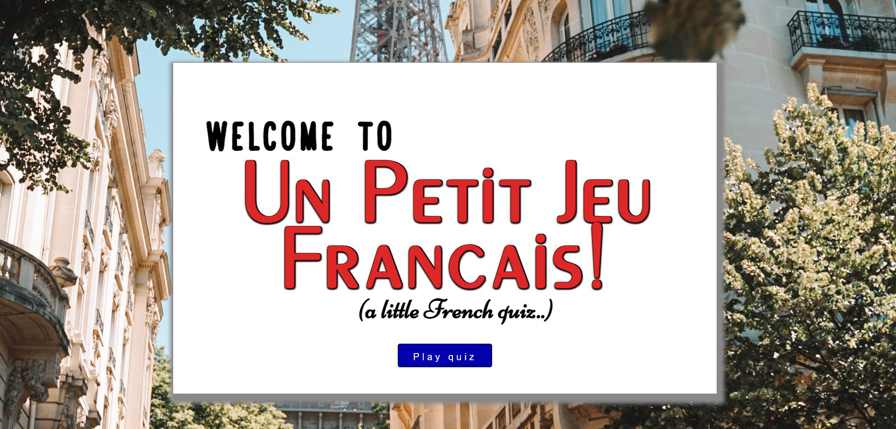
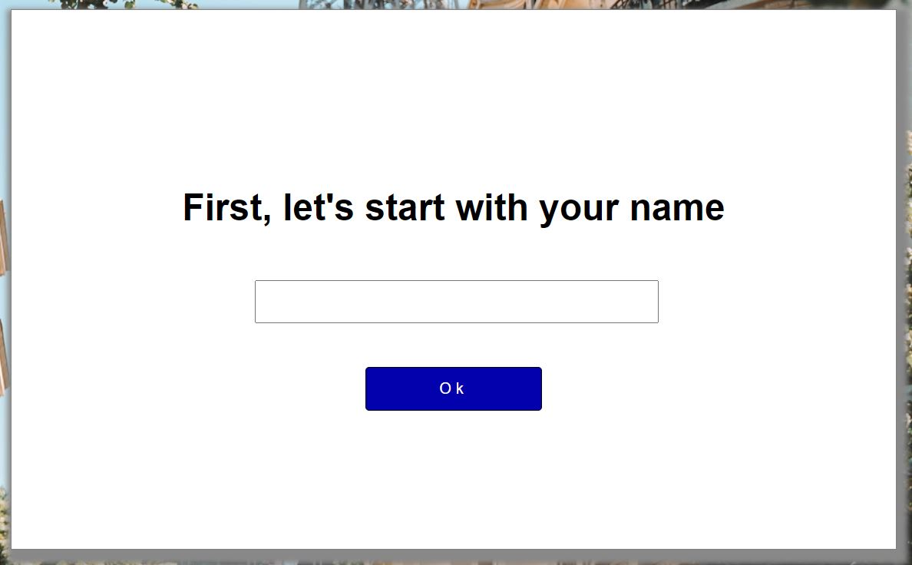
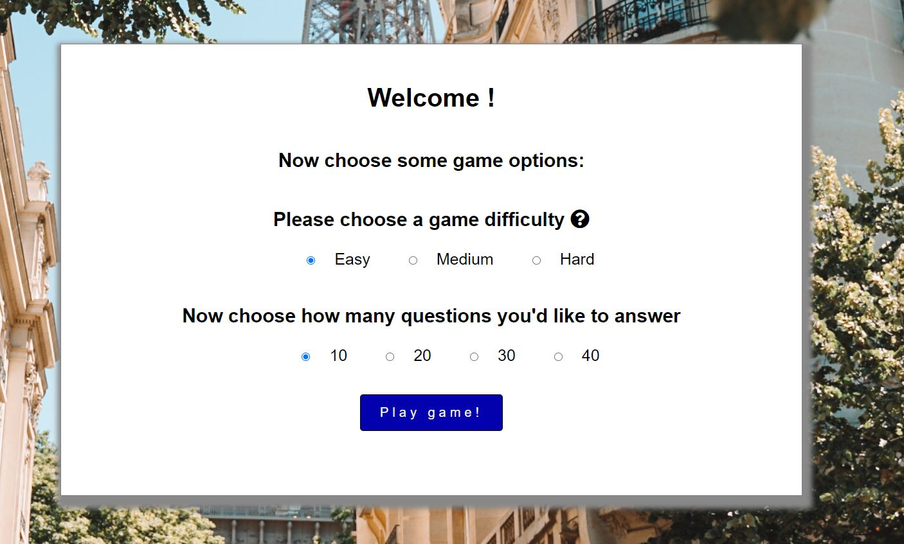
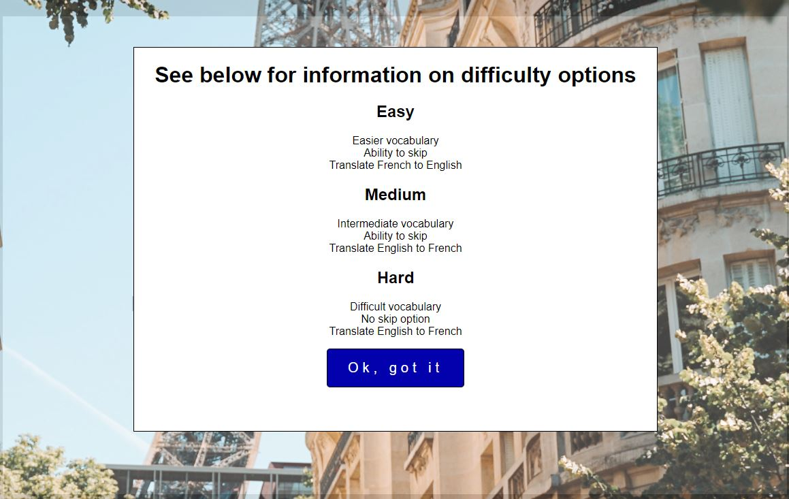
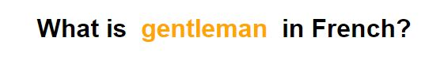
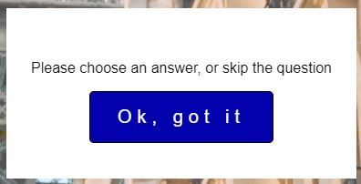
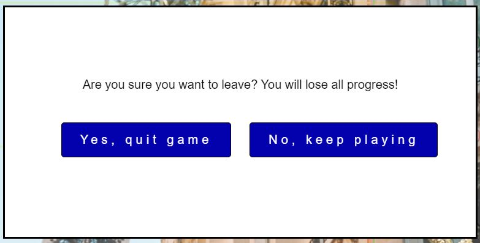
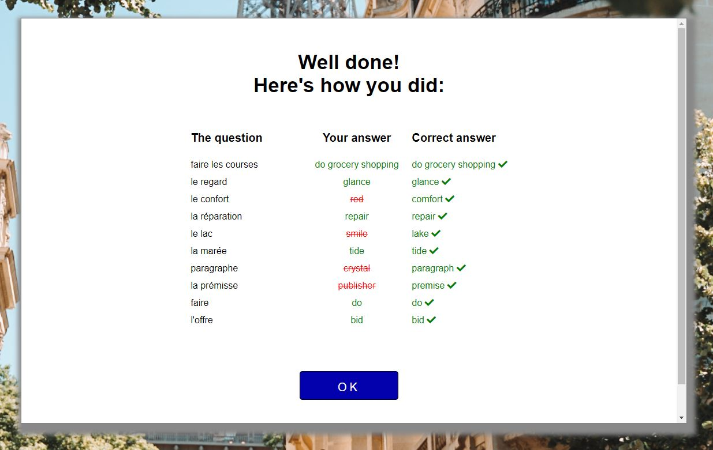

# Dunkeld Fitness Centre
First Milestone Project: a site to show facilities of a fictional gym

The website details information about a fitness centre which offers all standard facilities of a gym, workout classes, and a monthly or annual membership.  

# Table of Contents

- [UX](#ux)
    - [Website owner business goals](#website-owner-goals)
    - [User goals](#user-goals)
        - [New user goals](#new-user-goals)
        - [Returning user goals](#returning-user-goals)
        - [Website owner business goals](#website-owner-goals)
    - [User stories](#user-stories)
    - [Structure of the website](#structure-of-the-website)
    - [Wireframes](#wireframes)
    - [Surface](#surface)
- [Features](#features)
    - [All Page](#all-pages)
    - [Homepage](#homepage)
    - [Facilities](#facilities)
    - [Classes](#classes)
    - [Membership](#membership)
    - [About Us](#about-us)
    - [Features Left to Implement](#features-left-to-implement)
- [Technology](#technologies-used)
- [Testing](#testing)
    - [Functionality testing](#functionality-testing)
    - [Code Validation](#validator-testing)
    - [Compatibility testing](#compatibility-testing)
    - [Limitations of project](#limitations-of-project)
    - [User stories testing](#user-stories-testing)
- [Deployment](#deployment)
- [Credits](#credits)
- [Screenshots](#screenshots)

# UX  

## Website owner goals

The website owner's goals are to present quick, fun, dynamic French test for users to practice their vocabulary and receive feedback on their level in French.  There is enough game content for the quiz to not be repetitive.  It is designed to be easily accessible, requiring no sign-up, form or email input to play. 

## User goals

### New user goals:

* to determine if they can remember any French they learned in school
* to discover what their level in French is
* to have fun while improving their language skills

### Returning user goals

* to determine if their level in French has improved since last time
* to determine if they can beat their previous score
* to continue to practice their language skills

## User stories

### As a business owner:

* I would like to present a short quiz to those interested in learning the French language
* I would like users to be able to easily play the game without having to load a separate system or sign up to the website
* I would like users to feel like they can return periodically to improve their language skills
* I would like users to know where to find suitable learning material

### As a new customer:

* I would like to find a website which is basic, easy to load, intuitive and enjoyable to use
* I would like to be able to choose different difficulty options and lengths of the game
* I would like to know which answers I got right and wrong

### As a returning customer:

* I would like to be able to use the quiz once a week to maintain my level in French

## Structure of the website

The structure of the website is straightforward and intuitive.  There are three main pages: one which is the main game area, the second which is a library of language learning resources, and lastly a basic contact page. 

In the main game area, as the user navigates through the game the screens change - for example to choose game options, the actual quiz area, and feedback pages. 

The website is designed to be responsive on all devices; viewing the website on different screen sizes should not affect the user experience.  

## Wireframes

[Wireframes](https://wireframe.cc/) was used to visualise website ideas and maintain an idea of layout and styling.  See all pages concepts below.

### Intro Screen Design

### Name Input Design 

### Game Options Design

### Game Area Design

### Show Answers Design

### End Game Design

## Surface

### Fonts

The website largely uses IBM Plex Sans, with the main front page header in a custom French-looking font called Peignot, and sans-serif as a back-up font. 

### Colours

The colour scheme is kept to blacks and whites during the actual game, in order to be non-distracting to the user.  There is a pleasant background image of Paris.

The front page of the website is designed to look like a French road/street sign, with further emphasis on the French look with red, white and blue colors to replicate the French flag.

### Images

The only image used in the website is the background image of Paris, and is credited in the [Credits section](#credits). 

[Back to Table of contents](#table-of-contents)

# Features

The website has the following features:

## Intro and Outro
### Intro Screen Page

The game intro screen is designed to replicate a French street sign.  There are several types of font, with the main font in large red type as it is the title of the game.  The fonts were chosen to be "French-y", like one might find on a French sign or wine box.

There is a loose translation of the game title - Un Petit Jeu Francais/A Little French Quiz - beneath the red font, to not exclude users who are entirely new to the language. 

There is only one way forwards with this page, as demonstrated by one single button at the bottom of the page encouraging the user to click on and play the quiz. 

## Game Options
### Name Input Page

This screen is basic and one-dimensional, encouraging the user to input their name and advance forwards with the OK button.  The language is colloquial - "let's start with.." - to ease the user and put across the tone of the fun, non-serious game they are about to play.

If the user chooses not to input a name, they can still advance to the next screen.

### Game Options Page

The game options screen displays a welcome message with the user's name (or a generic name if they choose not to input theirs), and some game options to allow for different levels of game in the form of radio buttons.

There are three difficulty options (easy, medium, hard), and four game length options. The game length options simply increase the number of questions the user will answer (10, 20, 30 or 40 questions). The default options are 'Easy' and 10 questions.  

The user can determine the level of difficulty best suited to them by clicking the information icon, displaying a pop-up screen with the following information:

The difficulty options are based on:
* the difficulty of the vocabulary - for example, in 'Easy' game play, the user will expect to find a lot of French words which are very similar in English - eg panel/panneau
* the translation direction - it is easier to see the English word and choose the French answer from a list of French words, therefore in 'Easy' game play this is how the game is set up.  In 'Medium' and 'Hard' game play, this translation is reversed, noticeably increasing the complexity of the quiz
* the option to 'skip' a question - in 'Easy' and 'Medium' game play this feature is allowed, so that if the user is struggling to translate the word, they can skip the question.  This increases the 'skip' tally, not the 'incorrect' tally.  In 'Hard' game play, this feature is disabled, compelling the user to give it a go and risk an incorrect answer.

## Game Area Page

### Sections
The game area is split into two sections; on the left, the questions and multiple choice answers and buttons.  This is an active area which with the user can interact.

The right area of this section is informative only, displaying the game progress and score tallies.

### Question 

The question is displayed at the top of the left area, with the 'question word' in orange for emphasis, and a emphatic gap between this word and the others in the sentence to further draw attention to the word.  The font is always large and clear.

### Multiple Choice
The user can use the radio buttons to choose their translated answer, based on the question above.  There are either 4, 5, or 6 options depending on their chosen game difficulty. 

### Progress and Tallies
The score tallies display on the right of the page, incrementing as appropriate after each question.  The 'correct' tally displays in green, while 'incorrect' displays in red and 'skip' is grey.

The progress section allows the user to see:
* how many questions they have answered
* a reminder of how many questions they chose to answer ie the game length

### Buttons
There are three buttons on this page, to allow the user to either move onto the next question, or skip the question (not allowed in 'Hard' game play), or return home. 

The 'Next' button is emphasized with *****, as it is designed to be the chosen button.  It is also either furthest to the right, for the user to associate with forwards progress in the quiz, or at the top of button selection in smaller screen sizes.  If this button is pressed without the user choosing an answer, a warning message is displayed to prompt the user to either pick an answer or skip the question.

The Home button sits to the left, for the user to associate with regressing back.  There is also a warning message when this button is clicked, prompting the user that they will lose all quiz progress and return home.  They then have the option to lose progress (again, on the left to emphasize regression), or return to the quiz (on the right to imply progress). 

## Feedback Page
The user is given immediate feedback on their results, displaying the correct and incorrect answers.  
If the answer was incorrect, it is displayed in red strikethrough font, and the actual answer is displayed beside it in green font with a tick icon. 

This screen is important for the user to be able to gain positive feedback if they were successful, or learn from their mistakes.  

## Game End Page
The game end page displays a feedback message, dependant on how they performed in the quiz. 
Their final score is displayed out of the number of questions answered ie 4 / 10 and an additional message beneath it recommends next steps.

There are three buttons also displayed, allowing the user to either:
* return to their answers on the previous page 
* play the quiz again, which directs them to the game options page
* or return home to the intro screen

## Features Left to Implement

* Personal Training Page
* Information about classes
* FAQs
* Contact form

[Back to Table of contents](#table-of-contents)

# Technologies Used

## Languages

### HTML
as a structure language

### CSS
as a style language

### Javascript
as a coding language <<<<<>>>>>

### Font Awesome
as a resource for icons, such as social media links and logo

### Google Fonts
as a fonts library

### GitHub
as a software hosting platform to keep project in a remote location

### Git
as a version control system tracking

### Gitpod
as a development hosting platform

# Testing

## Functionality Testing

I used Chrome developer tools throughout the project for testing and solving problems with responsiveness and style issues.

## Validator Testing

### HTML Testing
The code was passed through the official HTML *W3C validator* with no errors returned. 

### CSS Testing
The code was passed through the official CSS *Jigsaw validator* with no errors returned. 

### Javascript Testing
The code was passed through the official Javascript *Jshint validator* with no errors returned. 

## Compatibility testing

The site was tested on all browser sizes during development, to ensure the website maintained a structured layout for all screen sizes.  

Finally the code was passed through [Am I Responsive](http://ami.responsivedesign.is/) to ensure all pages looked good on different sizes. 

## User stories testing  

### As a business owner:

* I would like to clearly exhibit what separates my gym from other gyms by showing off our professional and sophisticated gym space
    > There is a large high-resolution picture of one of the gym rooms on the Homepage, which gives a lasting first impression of the ambiance and vibe of the gym

* I would like to draw in new members by offering a competitive membership rate and attractive contract terms
    > The Homepage describes a low competitive contract rate, and the membership page reinstates this by listing the contract terms and specific pricing.  The user has to navigate to another page to find the specific price, taking in more information about the gym 

* I would like users to know exactly what facilities they will have access to if they visit the gym
    > The Facilities page clearly lists all gym spaces and equipment

* I would like users to feel like they can easily get in contact about any queries
    > There is contact information in the footer, which is displayed on each page, and there is a separate contact page which reiterates all this information

### As a new user:

* I would like to find out if this gym is a suitable location for me to attend everyday on my way home from work
    > The location of the gym is clear from the Homepage which names the town in the large centered title, there is a footer on each page which displays the address, and the About Us page displays this information as well as a Google Map of the gym location.

* I would like to find out what classes they have and how frequently they run
    > From the Classes page, I can clearly see that classes run 3 days per week, and that there is a choice of 4 classes.

* I would like to know how much it would cost for a membership and any terms related to my contract, and join the gym
    > On the Membership page, I can see there are only 2 options for a membership, and there is a list of contract terms. Beneath this is a basic form I can fill in to request a membership.

* I would like to know how to get in contact with the gym
    > There is contact information in the footer at the bottom of each page, as well as contact information in the About Us page. 

### As a returning user: 

* I would like to book onto one of the upcoming classes this week
    > When I'm on the Classes page, the footer which displays the telephone number is fixed in view. It clearly states at the top of the page that classes are to be booked over the phone.

* I want to get in contact about a problem with my membership
    > All contact information is clear in the footer and About Us page. 

* I want to find their social media links so I can join their Instagram stories
    > On the About Us page, there is a link to the gym's social media pages, which open in a separate tab.

## Limitations of Project

### Membership Form
The membership form does not do anything or lead to anywhere, aside from clearing itself of information after submission. 

### Social Media Links
The social media links simply link to the general site eg Facebook, as opposed to a specific page. 

### T&Cs
The terms and conditions link on the membership form does not link to a document. 

[Back to Table of contents](#table-of-contents)

## Unfixed Bugs

### Footer

The footer caused problems on some pages staying at the bottom of the page.  Some pages are only 1 screen size - for example Homepage and About Us.  Whereas the others have more content and therefore require scrolling.  In larger screen sizes it was desirable for the footer to remain fixed in position, but when reduced to smaller sizes and the footer changes to a taller column layout, it is preferred that the footer is hidden at the bottom and requires scrolling, so as not to take up the whole page.  

This idea in practice took some fiddling, and ultimately on a few pages, a fixed height "spacer" div was placed to keep the footer where it needed to be.  

### Gallery Layout

The gallery layout was adjusted for media queries, however since the position of images changed during browser resizing, there were gaps of varied heights revealing the white background of the gallery.  While in some screen sizes this could look tidier, it may add a sense of the 'social media' aspect of the gallery and imply that gaps are there because images are regularly uploaded to the site as they are taken.  Therefore this 'bug' is left unfixed. 

### CSS Warning

There were 4 CSS warnings, outlined in section [CSS Testing](#css-testing).

# Deployment
The site was deployed to GitHub pages. The steps to deploy are as follows:
* In the GitHub repository, navigate to the Settings tab
* From the source section drop-down menu, select the Master Branch
* Once the master branch has been selected, the page will be automatically refreshed with a detailed ribbon display to indicate the successful deployment.
* The live link can be found here 
 > [Dunkeld Fitness Centre](https://mojosbeans100.github.io/DunkeldFitnessCentre/.)

To run locally:
* Log in to GitHub and click on repository to download [Dunkeld Fitness Centre](https://github.com/MojosBeans100/DunkeldFitnessCentre)
* select `Code` and click Download the ZIP file.
* after download you can extract the file and use it in your local environment 

Alternatively you can [Clone](https://docs.github.com/en/free-pro-team@latest/github/creating-cloning-and-archiving-repositories/cloning-a-repository)
or [Fork](https://docs.github.com/en/free-pro-team@latest/github/getting-started-with-github/fork-a-repo)
this repository ([Dunkeld Fitness Centre](https://github.com/MojosBeans100/DunkeldFitnessCentre)) into your github account.

# Credits
## Content
All website content was written by the author.  

The ReadMe format was inspired by the template from Code Institute [Code Institute ReadMe](https://github.com/Code-Institute-Solutions/readme-template) as well as [Annie's Portfolio Website](https://github.com/marcin-kli/MP1/blob/Milestone-Projects/README.md).

The gallery layout on the Classes page was inspired by that of the Love Running Project from Code Institute [Love Running Gallery](https://learn.codeinstitute.net/courses/course-v1:CodeInstitute+LR101+2021_T1/courseware/4a07c57382724cfda5834497317f24d5/06b2421978a4470d844b06c7bf2c50a2/).

Some other gym and fitness websites which inspired the author for content and style:
* [Dunkeld House Hotel](https://www.dunkeldhousehotel.co.uk/)
* [Pure Gym](https://www.puregym.com/)
* [The Gym](https://www.thegymgroup.com/)

## Media 
Most media images were sourced from [Pexels](https://www.pexels.com/) website.

Credits to: 

* Marriot Gym [Main Image](https://www.marriott.com.au/hotels/hotel-information/fitness-center/hydlk-itc-kohenur-a-luxury-collection-hotel-hyderabad/)
* @goumbik
* @monstera
* @victorfreitas
* @cottonbro
* @elly-fairytale
* @yan-krukov
* @cliff-booth
* @anastasia0shuraeva
* @max-vakhtbovych
* @andrea-piacquadio
* @karolina-grabowska
* @lukas
* @william-choquette
* @leon-ardho
* @li-sun
* @roman-davayposmotrim
* @gustavo-fring
* @pixabay
* @eternal-happiness

[Back to Table of contents](#table-of-contents)

