# Un Petit Jeu Francais
Second Milestone Project: a site to provide a mini quiz in French

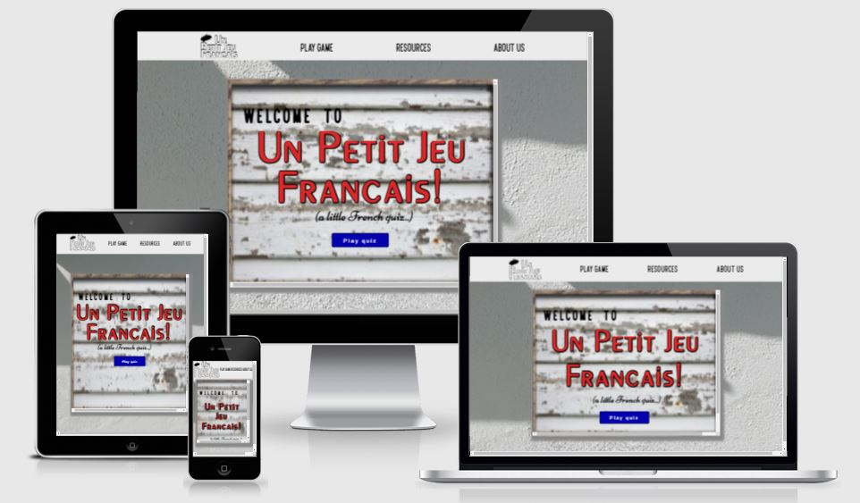

The website provides a short, interactive quiz for user's who would like to practice or test their French level. 

# Table of Contents

- [UX](#ux)
    - [Website owner business goals](#website-owner-goals)
    - [User goals](#user-goals)
        - [New user goals](#new-user-goals)
        - [Returning user goals](#returning-user-goals)
        - [Website owner business goals](#website-owner-goals)
    - [User stories](#user-stories)
    - [Structure of the website](#structure-of-the-website)
    - [Wireframes](#wireframes)
    - [Surface](#surface)
- [Features](#features)
    - [Nav Menu](#nav-menu)
    - [Intro](#intro)
    - [Game Options](#game-options)
    - [Game Area](#game-area)
    - [Feedback](#feedback-page)
    - [Features Left to Implement](#features-left-to-implement)
- [Technology](#technologies-used)
- [Testing](#testing)
    - [Functionality testing](#functionality-testing)
    - [Code Validation](#validator-testing)
    - [Compatibility testing](#compatibility-testing)
    - [Limitations of project](#limitations-of-project)
    - [User stories testing](#user-stories-testing)
- [Deployment](#deployment)
- [Credits](#credits)
- [Screenshots](#screenshots)

# UX  

## Website owner goals

The website owner's goals are to present quick, fun, dynamic French test for users to practice their vocabulary and receive feedback on their level in French.  There is enough game content for the quiz to not be repetitive.  

It is designed to be easily accessible, requiring no sign-up, form or email input to play.    It is not the goal of this particular site to provide learning material, rather a fun game to test the user's vocabulary. 

## User goals

### New user goals:

* to determine if they can remember any French they learned in school
* to discover what their level in French is
* to have fun while improving their language skills

### Returning user goals

* to determine if their level in French has improved since last time
* to determine if they can beat their previous score
* to continue to practice their language skills

## User stories

### As a website owner:

* I would like to present a short quiz to those interested in learning the French language
* I would like users to be able to easily play the game without having to load a separate system or sign up to the website
* I would like users to feel like they can return periodically to improve their language skills
* I would like users to know where to find suitable learning material

### As a new customer:

* I would like to find a website which is basic, easy to load, intuitive and enjoyable to use
* I would like to be able to choose different difficulty options and lengths of the game
* I would like to know which answers I got right and wrong

### As a returning customer:

* I would like to be able to use the quiz once a week to maintain my level in French

## Structure of the website

The structure of the website is straightforward and intuitive.  There are three main pages: one which is the main game area, the second which is a library of language learning resources, and lastly a basic 'about us'page. 

In the main game area, as the user navigates through the game the screens change - for example to choose game options, the actual quiz area, and feedback pages. 

The website is designed to be responsive on all devices; viewing the website on different screen sizes should not affect the user experience.  

## Wireframes

[Wireframes](https://wireframe.cc/) was used to visualise website ideas and maintain an idea of layout and styling.  See all pages concepts below.

### Intro Screen Design
The Resources and About Us page have a very similar layout - simply with different text inside the main centered div.
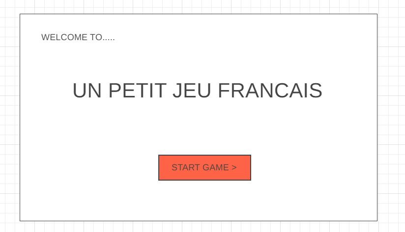

### Game Options Design
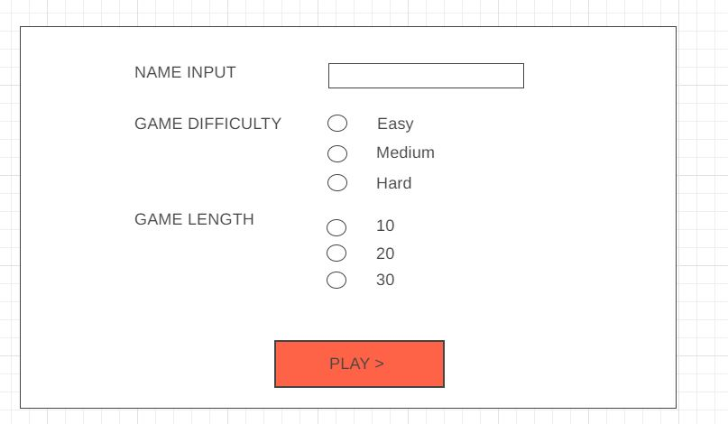

### Game Area Design
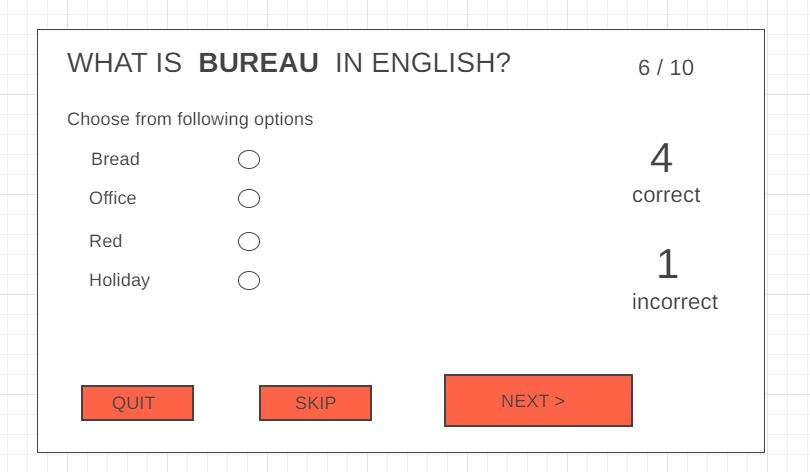

### Show Answers Design
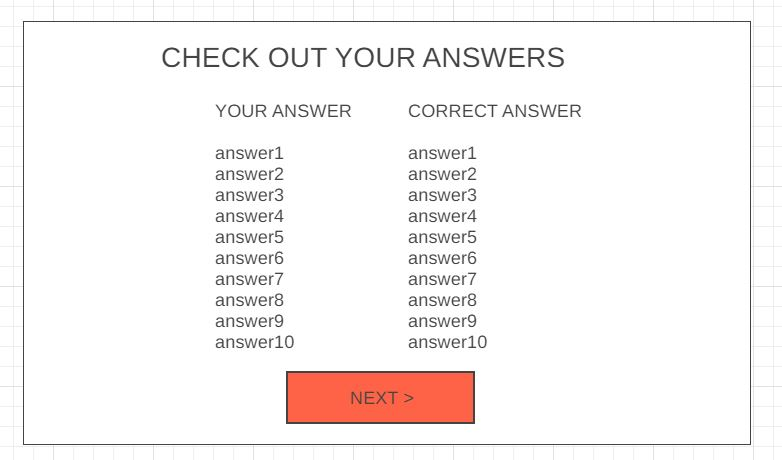

### End Game Design
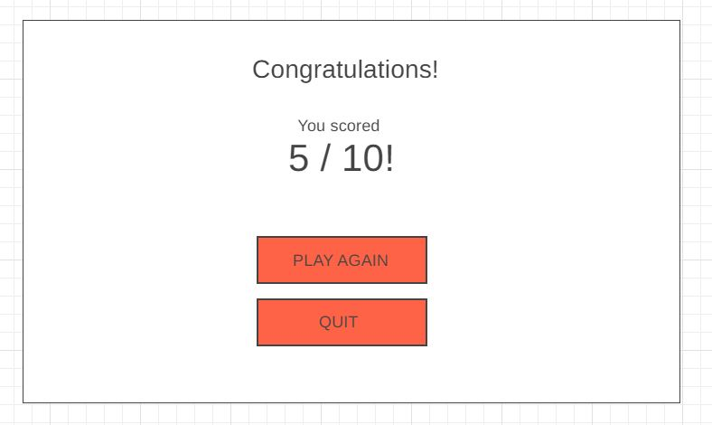

## Surface

### Fonts

The website largely uses IBM Plex Sans, with the main front page header in a custom French-looking font called Peignot, and sans-serif as a back-up font. 

Only basic, non-custom fonts are used in the main area to avoid distraction from the game. 

### Colours

The colour scheme is kept to blacks and whites during the actual game, with a bit of red and blue to continue the French theme, in order to be non-distracting to the user.  There is a pleasant background image of Paris.

The front page of the website is designed to look like a French road/street sign, with further emphasis on the French look with red, white and blue colors to replicate the French flag.  See below the inspiration for the front page:

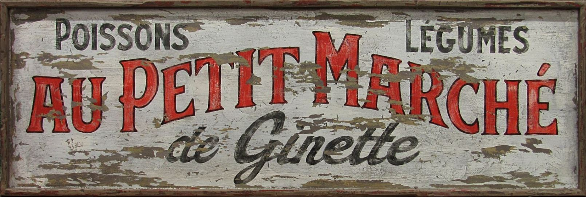

### Images

The only images used in the website are the background images of Paris, and are credited in the [Credits section](#credits). 

[Back to Table of contents](#table-of-contents)

# Features

The website has the following features:

## Nav Menu
The nav menu is set as a bar at the top of each page for intuitive navigation.  The main website logo sits furthest to the left, and can be used to return to the main screen, along with the Play Game nav option. 

The logo carries the same styling as the title on this page, and has a fun beret icon.

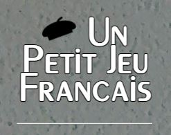

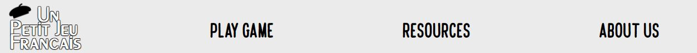

## Intro
### Intro Screen Page
The game intro screen is designed to replicate a French street sign.  There are several types of font, with the main font in large red type as it is the title of the game.  The fonts were chosen to be "French-y", like one might find on a French sign or wine box.

There is a loose translation of the game title - Un Petit Jeu Francais/A Little French Quiz - beneath the red font, to not exclude users who are entirely new to the language. 

There is only one way forwards with this page, as demonstrated by one single button at the bottom of the page encouraging the user to click on and play the quiz. 

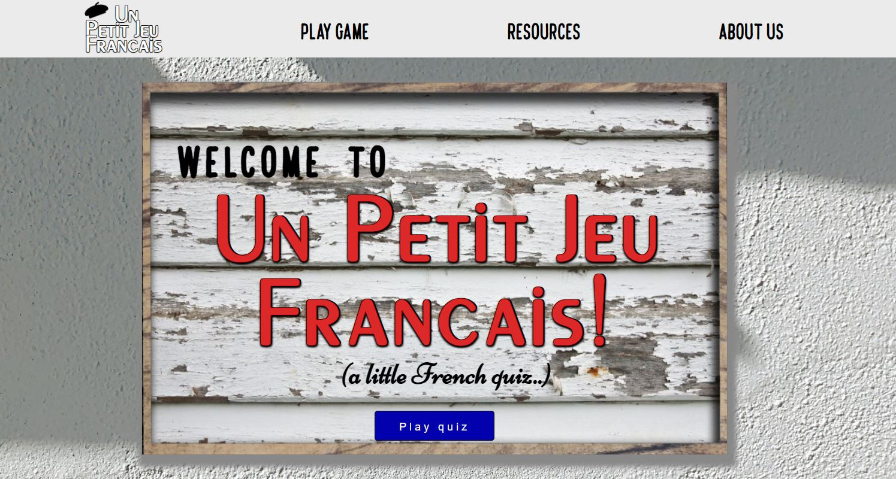

## Game Options
### Name Input Page
This screen is basic and one-dimensional, encouraging the user to input their name and advance forwards with the OK button.  The language is colloquial - "let's start with.." - to ease the user and put across the tone of the fun, non-serious game they are about to play.

If the user chooses not to input a name, they can still advance to the next screen.

### Game Options Page
The game options screen displays a welcome message with the user's name (or a generic name if they choose not to input theirs), and some game options to allow for different levels of game in the form of radio buttons.

There are three difficulty options (easy, medium, hard), and four game length options. The game length options simply increase the number of questions the user will answer (10, 20, 30 or 40 questions). The default options are 'Easy' and 10 questions.  

The user can determine the level of difficulty best suited to them by clicking the information icon, displaying a pop-up screen with the following information:

The difficulty options are based on:
* the difficulty of the vocabulary - for example, in 'Easy' game play, the user will expect to find a lot of French words which are very similar in English - eg panel/panneau
* the translation direction - it is easier to see the English word and choose the French answer from a list of French words, therefore in 'Easy' game play this is how the game is set up.  In 'Medium' and 'Hard' game play, this translation is reversed, noticeably increasing the complexity of the quiz
* the option to 'skip' a question - in 'Easy' and 'Medium' game play this feature is allowed, so that if the user is struggling to translate the word, they can skip the question.  This increases the 'skip' tally, not the 'incorrect' tally.  In 'Hard' game play, this feature is disabled, compelling the user to give it a go and risk an incorrect answer.

## Game Area 

### Sections
The game area is split into two sections; on the left, the questions and multiple choice answers and buttons.  This is an active area with which the user can interact.

The right area of this section is informative only, displaying the game progress and score tallies.

### Question 
The question is displayed at the top of the left area, with the 'question word' in orange for emphasis, and a emphatic gap between this word and the others in the sentence to further draw attention to the word.  The font is always large and clear.

### Multiple Choice
The user can use the radio buttons to choose their translated answer, based on the question above.  There are either 4, 5, or 6 options depending on their chosen game difficulty. 

### Progress and Tallies
The score tallies display on the right of the page, incrementing as appropriate after each question.  The 'correct' tally displays in green, while 'incorrect' displays in red and 'skip' is grey.

The progress section allows the user to see:
* how many questions they have answered
* a reminder of how many questions they chose to answer ie the game length
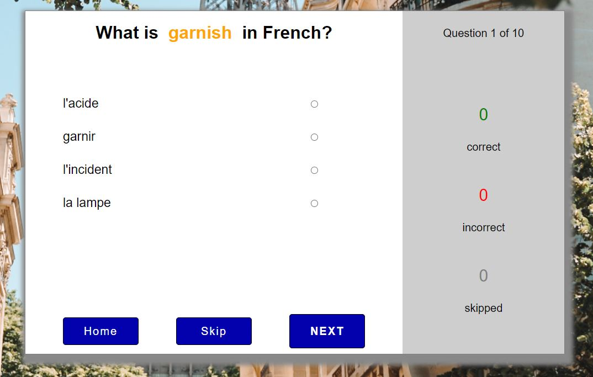

### Buttons
There are three buttons on this page, to allow the user to either move onto the next question, or skip the question (not allowed in 'Hard' game play), or return home.  The buttons have a hover effect, and a 'depressed' look when clicked. 

The 'Next' button is emphasized with a larger size, as it is designed to be the chosen button.  It is also either furthest to the right, for the user to associate with forwards progress in the quiz, or at the top of button selection in smaller screen sizes.  If this button is pressed without the user choosing an answer, a warning message is displayed to prompt the user to either pick an answer or skip the question.

The Home button sits to the left, for the user to associate with regressing back.  There is also a warning message when this button is clicked, prompting the user that they will lose all quiz progress and return home.  They then have the option to lose progress (again, on the left to emphasize regression), or return to the quiz (on the right to imply progress). 

## Feedback Page
The user is given immediate feedback on their results, displaying the correct and incorrect answers.  
If the answer was incorrect, it is displayed in red strikethrough font, and the actual answer is displayed beside it in green font with a tick icon. 

This screen is important for the user to be able to gain positive feedback if they were successful, or learn from their mistakes.  The final score is displayed numerically on the next page. 

## Game End Page
The game end page displays a feedback message, dependant on how they performed in the quiz. 
Their final score is displayed out of the number of questions answered ie 4 / 10 and an additional message beneath it recommends next steps.

There are three buttons also displayed, allowing the user to either:
* return to their answers on the previous page 
* play the quiz again, which directs them to the game options page
* or return home to the intro screen
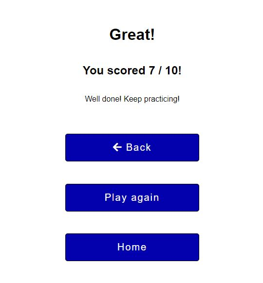

## Resources Page
The Resources page provides a short summary of learning material for the user to use to improve their language skills.  This page is necessary because the quiz itself does not necessarily serve this purpose, rather is a 'testing' tool as opposed to a 'learning' tool.

The information sits inside the centered div and the user can scroll through the recommended material. 

## Features Left to Implement

* Timer function
> A timer function was considered, which would countdown a number of seconds until moving onto the next question (if user had not selected an answer in this time, the incorrect tally would be incremented).  The timer length would be dependant on game difficulty, for example 15 secs for 'Easy', 10 secs for 'Medium' and 5 secs for 'Hard'.   In fact it was decided that this was not a necessary function and may take away from the fun, easy-going aspect of the game, but it could be added as an option on the Game Options screen. 

* Active feedback
> Active feedback, such as pop-up congratulatory messages in speech bubbles was considered if the user scored 3 in a row, or words of encouragement if user scored 3 incorrect in a row. 

* Sound effects
> Sounds effects, such as a 'click' when selecting the radio button answer; or pressing a button; or a 'ding' on a correct answer, could be added. A Lo-Fi Parisian Coffee Cafe soundtrack was considerd to play during the game play.  This could be added as an optional check ie Sound On/Sound Off at the start of the game.   For example, see Youtube video - [French Music](https://www.youtube.com/watch?v=LpZ9Xv7oR9o)

* Answers highlighted in orange
> It would be a beneficial UX feature to highlight the user's answer in orange when the corresponding radio button is checked.  This would draw attention to their selection, and the same color orange as the 'question' word would associate the two in the user's mind. 

* Enter key event listeners
> 

[Back to Table of contents](#table-of-contents)

# Technologies Used

## Languages

### HTML
as a structure language

### CSS
as a style language

### Javascript
to implement Front-End interactivity

### Font Awesome
as a resource for icons, such as social media links and logo

### Google Fonts
as a fonts library

### GitHub
as a software hosting platform to keep project in a remote location

### Git
as a version control system tracking

### Gitpod
as a development hosting platform

# Testing

## Functionality Testing

I used Chrome developer tools throughout the project for testing and solving problems with responsiveness and style issues.

## Validator Testing

### HTML Testing
The code was passed through the official HTML *W3C validator* with no errors returned. 

### CSS Testing
The code was passed through the official CSS *Jigsaw validator* with no errors returned. 

### Javascript Testing
The code was passed through the official Javascript *Jshint validator* with no errors returned. 

## Compatibility testing

The site was tested on all browser sizes during development, to ensure the website maintained a structured layout for all screen sizes.  

Finally the code was passed through [Am I Responsive](http://ami.responsivedesign.is/) to ensure all pages looked good on different sizes. 

## User stories testing  

### As a website owner:

* I would like to present a short quiz to those interested in learning the French language
    > The quiz is presented on the front page of the website, and it is clear from this page (both the game title and translated title beneath) what the game is about. 

* I would like users to be able to easily play the game without having to load a seperate system or sign up to the website
    > The quiz opens up on the front page of the website, giving the user the opportunity to play straight away.

* I would like users to feel like they can return periodically to improve their language skills
    > The language arrays are large enough that it is unlikely the user will find the game repetitive - the specific length of the arrays is stated in the game information on the About Us page. 

* I would like users to know where to find suitable learning material
    > There is a learning resources page in the nav menu which links to other learning material. 

### As a new user:

* to determine if they can remember any French they learned in school
    > There are many common words in this game which I learned at school, as well as some new ones to guess which will further my language development. 

* to discover what their level in French is
    > I have played the game of various difficulties and based on my feedback and score, I have an understanding of what my level in French is. 

* to have fun while improving their language skills
    > The game is short, fun, and colourful.

### As a returning user: 

* I would like to be able to use the quiz once a week to maintain my level in French

## Limitations of Project

### Language Arrays
It is important for the game to not become repetitive after a few goes, therefore the language arrays in which the French/English words are located should be long enough to accomodate for a few games.

Many language arrays can be found online, however because it was a goal of the website owner to provide different difficulty levels, a process to assign difficulty to each word was carried out.  In reality, this could not effectively be completed on an array of 250,000 words (for example), therefore a smaller array was chosen.

While the game was tested many times during developement, and there were no significant issues found within the language arrays, with such a large array of words it is possible there is a bug.

[Back to Table of contents](#table-of-contents)

# Deployment
The site was deployed to GitHub pages. The steps to deploy are as follows:
* In the GitHub repository, navigate to the Settings tab
* From the source section drop-down menu, select the Master Branch
* Once the master branch has been selected, the page will be automatically refreshed with a detailed ribbon display to indicate the successful deployment.
* The live link can be found here 
 > [Un Petit Jeu Francais](https://mojosbeans100.github.io/un-petit-jeu-francais/.)

To run locally:
* Log in to GitHub and click on repository to download [Un Petit Jeu Francais](https://github.com/MojosBeans100/un-petit-jeu-francais)
* select `Code` and click Download the ZIP file.
* after download you can extract the file and use it in your local environment 

Alternatively you can [Clone](https://docs.github.com/en/free-pro-team@latest/github/creating-cloning-and-archiving-repositories/cloning-a-repository)
or [Fork](https://docs.github.com/en/free-pro-team@latest/github/getting-started-with-github/fork-a-repo)
this repository ([Un Petit Jeu Francais](https://github.com/MojosBeans100/un-petit-jeu-francais)) into your github account.

# Credits
## Content
All website content was written by the author. 

The ReadMe format was inspired by the template from Code Institute [Code Institute ReadMe](https://github.com/Code-Institute-Solutions/readme-template) as well as [Annie's Portfolio Website](https://github.com/marcin-kli/MP1/blob/Milestone-Projects/README.md), and the previous Milestone 1 Project ReadMe.

Some other French language websites which inspired the author for content and style:
* [Test Your Language](https://testyourlanguage.com/french-quiz)
* [My Languages](http://mylanguages.org/french_quiz.php)
* [ESL Languages](https://www.esl-languages.com/en/online-language-tests/french-test)

## Media 
All media images were sourced from [Pexels](https://www.pexels.com/) website.

Credits to: 

* @daria-shevtsova  - background image
* @laura-stanley    - background image
* @thorston-technoman    - background image
* [www.flaticon.com](https://www.freepik.com)   - beret icon in logo
* [Eiffel Tower icon by Icons8](https://icons8.com/icon/102642/eiffel-tower)    - Eiffel Tower icon
* [French Flag Icon](https://www.countryflags.com/france-flag-icon/)    - French flag icon
* [French Language Array](http://frequencylists.blogspot.com/2015/12/the-2000-most-frequently-used-french.html)  - for list of French/English words
* [French Verbs Array](https://www.talkinfrench.com/wp-content/uploads/2013/09/200-most-common-verbs.pdf)   - another list of French/English words
* [French Sign](https://www.ecosia.org/images?q=french%20sign#id=C217CF0CBD9870696B5A1E040B0225A2C7C41711)  - background image for intro screen
* [Sharkstock Fonts](https://www.1001fonts.com/cafe-francoise-font.html)     - for custom font
* [George Williams](https://www.1001fonts.com/peignot-font.html)    - for custom font

[Back to Table of contents](#table-of-contents)

